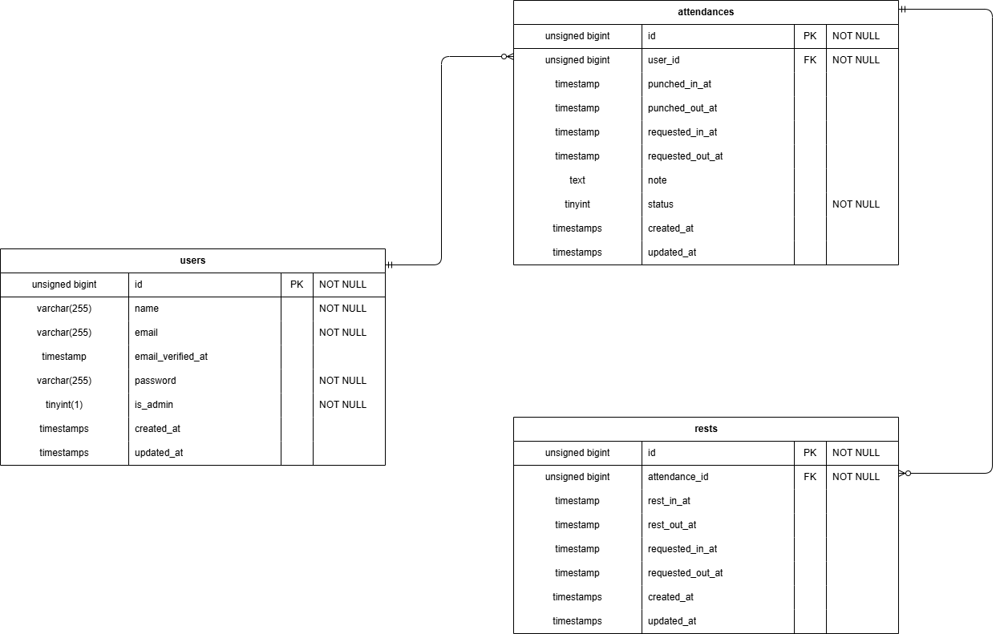

# 勤怠管理アプリ 

## 概要
- できること：一般ユーザーが打刻（出勤・休憩・退勤）し、管理者が勤怠を確認できる勤怠管理アプリです
- 工夫した点：休憩を1日複数回取れるように `rests` を分離し、申請ステータスで承認フローを安全に管理しました

## 主な機能
### 一般ユーザー
- 会員登録・ログイン・ログアウト
- 打刻（出勤・休憩開始・終了・退勤）
- 勤怠の修正申請（承認待ち→承認後に反映）

### 管理者
- 勤怠の確認
- 修正申請の承認

このアプリは、スクールの仕様書をもとに未経験から1ヶ月で完成させることを目標に開発しました。AIはコードを丸ごと生成させるためではなく、「なぜこのテーブルが必要か」「データがどのように画面まで届くか」を理解するための壁打ち相手として活用しました。特に勤務時間（打刻−休憩）の計算ロジックの整理に苦労しましたが、試行錯誤しながら実装し、機能テストで仕様どおりに動くことを確認する重要性も実感しました。今後は計算ロジックの理解をさらに深め、画面の分かりやすさも改善していきたいです。

## 環境構築 

**Dockerビルド** 
```
git clone git@github.com:mako236630/attendance-management-app.git
cd attendance-management-app 
docker-compose up -d --build
```


**Laravel 環境構築** 
```
docker-compose exec php bash
composer install
cp .env.example .env
```
.env は、DB接続部分を修正してください。 
また、Mailtrapの設定をしてください。
```
php artisan key:generate 
php artisan migrate 
php artisan db:seed
```

## テスト
```
docker-compose exec php bash
php artisan test
```
  
## 開発環境 
 
- 会員登録画面: http://localhost/register 
- ログイン画面(一般ユーザー): http://localhost/login  
一般ユーザーでの機能確認には、以下のテストアカウントをご利用ください。  
メールアドレス: test@example.com  
パスワード: password  

- ログイン画面(管理者): http://localhost/admin/login  
 管理者での機能確認には、以下のテストアカウントをご利用ください。  
 メールアドレス: admin@example.com  
 パスワード: adminpass  
 
 - phpMyAdmin: http://localhost:8080/  
 
## 使用技術  
 - nginx 1.21.1
 - MySQL 8.0.26
 - php 8.1.34
 - Laravel 8.83.8  
 
## ER図  
 - rests(休憩データ): 一日の中で複数回の休憩を可能にする為、休憩データを独立させattendances(勤怠データ)と1対多で紐付けています。
 - 打刻時刻と修正時刻について: 打刻時刻と修正申請中の時刻を別のカラムで管理し、管理者による承認後のデータ更新を安全に行えるようにしています。
 - 申請ステータスの管理: attendances(勤怠データ)にstatusカラムを設け、「0:未申請」「1:承認待ち」「2:承認済み」の状態を管理し管理者が確認・承認したデータのみを正として扱えるようにしました。  
 



